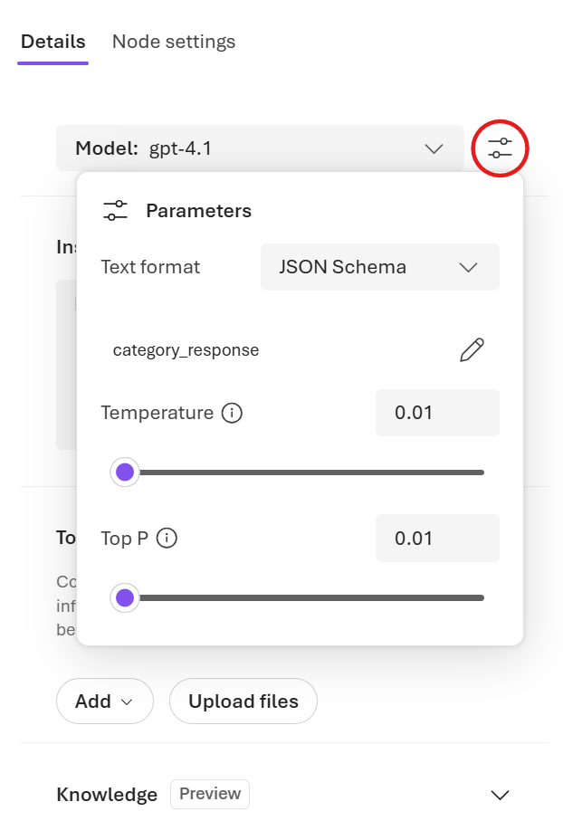

---
lab:
    title: 'Build a workflow in Microsoft Foundry'
    description: 'Use the Microsoft Foundry portal to create workflows for AI agents.'
    level: 300
    duration: 45
    islab: true
---

# Build a workflow in Microsoft Foundry

In this exercise, you'll use the Microsoft Foundry portal to create a workflow. Workflows are UI-based tools that allow you to define sequences of actions involving AI agents. For this exercise, you'll create a workflow that helps resolve customer support requests.

**Workflow overview**

- Collect incoming support tickets

    The workflow starts with a predefined array of customer support issues. Each item in the array represents an individual support ticket submitted to ContosoPay.

- Process tickets one at a time

    A for-each loop iterates over the array, ensuring each support ticket is handled independently while using the same workflow logic.

- Classify each ticket with an AI agent

    For each ticket, the workflow invokes a Triage Agent to classify the issue as Billing, Technical, or General, along with a confidence score.

- Handle uncertainty with conditional logic

    If the confidence score is below a defined threshold, the workflow recommends additional info for that ticket.

- Route based on issue category

    Billing issues are flagged for escalation and removed from the automated resolution path.
    Technical and General issues continue through automated handling.

- Generate a recommended response

    For non-billing tickets, the workflow invokes a Resolution Agent to draft a category-appropriate support response.

This exercise should take approximately **30** minutes to complete.

> **Note**: The workflow builder in Microsoft Foundry is currently in preview. You may experience some unexpected behavior, warnings, or errors. If you encounter any issues that block your progress, you may need to start over with a new project and workflow.

## Create a Foundry project

Let's start by creating a Foundry project.

1. In a web browser, open the [Foundry portal](https://ai.azure.com) at `https://ai.azure.com` and sign in using your Azure credentials.

1. Ensure the **New Foundry** toggle is set to *On*.

    

1. You may be prompted to create a new project before continuing to the New Foundry experience. Select **Create a new project**.

    

    If you're not prompted, select the projects drop down menu on the upper left, and then select **Create new project**.

1. Enter a name for your Foundry project in the textbox and select **Create**.

    Wait a few moments for the project to be created. The new Foundry portal home page should appear with your project selected.

1. Close the **Welcome to the new Microsoft Foundry** dialog if it appears.

    The dialog may prompt you to create an agent which is not necessary at this time. Agents will be created in a later step.

## Create a customer support triage workflow

In this section, you'll create a workflow that helps triage and respond to customer support requests for a fictional company called ContosoPay. The workflow uses two AI agents that classify and respond to support tickets.

1. On the Foundry portal home page, select **Build** from the toolbar menu.

1. On the left-hand menu, select **Agents** then select the **Workflows** tab.

1. In the upper right corner, select **Create** > **Blank workflow** to create a new blank workflow.

    The type of workflow you'll create in this exercise is a sequential workflow. However, starting with a blank workflow will simplify the process of adding the necessary nodes.

1. Select **Save** in the visualizer to save your new workflow. In the dialog box, enter a name for your workflow, such as *ContosoPay-Customer-Support-Triage*, and then select **Save**.

### Create a ticket array variable

1. In the workflow visualizer, select the **+** (plus) icon to add a new node.

1. In the workflow actions menu, under **Data transformation**, select **Set variable** to add a node that initializes an array of support tickets.

1. In the **Set variable** node editor, create a new variable by selecting **Create new variable**. Enter a name such as *SupportTickets*.

    

    The new variable should appear as `Local.SupportTickets`.

1. In the **To value** field, enter the following array that contains sample support tickets:

    ```output
   [ 
    "The API returns a 403 error when creating invoices, but our API key hasn't changed.", 
    "Is there a way to export all invoices as a CSV?", 
    "I was charged twice for the same invoice last Friday and my customer is also seeing two receipts. Can someone fix this?"]
    ```

1. Select **Done** to save the node.

### Add a for-each loop to process tickets

1. Select the **+** (plus) icon below the **Set variable** and create a **For each** node to process each support ticket in the array.

1. In the **For each** node editor, set the **Select the items to loop for each** field to the variable you created earlier: `Local.SupportTickets`.

1. In the **Loop Value Variable** field, create a new variable named `CurrentTicket`.

1. Select **Done** to save the node.

### Invoke an agent to classify the ticket

1. Select the **+** (plus) icon within the **For each** node to add a new node that classifies the current support ticket.

1. In the workflow actions menu, under **Invoke**, select **Invoke Agent** to add an agent node.

1. In the **Invoke agent** node editor, under **Select an agent**, select **Create new agent**.

1. Enter an agent name such as *Triage-Agent* and select **Create**.

#### Configure the agent settings

1. In the editor, under **Details**, select the **Parameters** button near the model name.

    

1. In the **Parameters** pane, next to **Text format**, select **JSON Schema**.

1. In the **Add response format** pane, enter the following definition and select **Save**:

    ```json
    {
    "name": "category_response",
    "schema": {
        "type": "object",
        "properties": {
            "customer_issue": {
                "type": "string"
            },
            "category": {
                "type": "string"
            },
            "confidence": {
                "type": "number"
            }
        },
        "additionalProperties": false,
        "required": [
            "customer_issue",
            "category",
            "confidence"
        ]
    },
    "strict": true
    }
    ```

1. In the Invoke Agent Details pane, set the **Instructions** field to the following prompt:

    ```output
    Classify the user's problem description into exactly ONE category from the list below. Provide a confidence score from 0 to 1.

    Billing
    - Charges, refunds, duplicate payments
    - Missing or incorrect payouts
    - Subscription pricing or invoices being charged

    Technical
    - API errors, integrations, webhooks
    - Platform bugs or unexpected behavior

    General
    - How-to questions
    - Feature availability
    - Data exports, reports, or UI navigation

    Important rules
    - Questions about exporting, viewing, or downloading invoices are General, not Billing
    - Billing ONLY applies when money was charged, refunded, or paid incorrectly
    ```

1. Select **Action settings** to configure the input and output of the agent.

1. Set the **Input message** field to the  `Local.CurrentTicket` variable.

1. Under **Save agent output message as**, create a new variable named `TriageOutputText`.

1. Under **Save the output json_object as**, create a new variable named `TriageOutputJson`.

1. Select **Done** to save the node.

### Handle low-confidence classifications

1. Select the **+** (plus) icon below the **Invoke agent** node to add a new node that handles low-confidence classifications.

1. In the workflow actions menu, under **Flow**, select **If/Else** to add a conditional logic node.

1. In the **If/Else** node editor, select the pencil icon to edit the **If** branch condition.

1. Set the **Condition** field to the following expression to check if the confidence score is above 0.6:

    ```output
   Local.TriageOutputJson.confidence > 0.6
    ```

1. Select **Done** to save the node.

### Recommend additional info for low-confidence tickets

1. In the visualizer, under the **Else** branch of the **If/Else condition** node, select the **+** (plus) icon to add a new node that recommends additional information for low-confidence tickets.

1. In the workflow actions menu, under **Basics**, select **Send message** to add a send message activity.

1. In the **Send message** node editor, set the **Message to send** field to the following response:

    ```output
   The support ticket classification has low confidence. Requesting more details about the issue: "{Local.CurrentTicket}"
    ```

### Route the ticket based on category

In this section, you'll add conditional logic to route the ticket based on its classified category if the confidence score is high enough.

1. In the visualizer, under the **If** branch of the **If/Else condition** node, select the **+** (plus) icon to add a new node that routes the ticket based on its category.

1. In the workflow actions menu, under **Flow**, select **If/Else** to add another conditional logic node.

1. In the **If/Else** node editor, set the **If Condition** to the following expression to check if the ticket category is "Billing":

    ```output
    Local.TriageOutputJson.category = "Billing"
    ```

1. Select the **+** (plus) icon under the **If** branch of the **If/Else** node to add a new node that drafts a response for non-billing tickets.

1. In the workflow actions menu, under **Basics**, select **Send message** to add a send message activity.

1. In the **Send message** node editor, set the **Message to send** to the following response:

    ```output
   Escalate billing issue to human support team.
    ```

1. Select **Done** to save the node.

### Generate a recommended response

1. In the visualizer, select the **+** (plus) icon under the **Else** branch of the second **If/Else** node to add a new node that drafts a response for non-billing tickets.

1. In the workflow actions menu, under **Agent**, select **Invoke agent** to add an agent node.

1. In the **Invoke agent** node editor, select **Create new agent**.

1. Enter an agent name such as *Resolution-Agent* and select **Create**.

1. In the agent editor, set the **Instructions** field to the following prompt:

    ```output
    You are a customer support resolution assistant for ContosoPay, a B2B payments and invoicing platform.

    Your task is to draft a clear, professional, and friendly support response based on the issue category and customer message.

    Guidelines:
    If the issue category is Technical:
    Suggest 1–2 common troubleshooting steps at a high level.

    Avoid asking for logs, credentials, or sensitive data.

    Do not imply fault by the customer.
    If the issue category is General:
    Provide a concise, helpful explanation or guidance.
    Keep the response under 5 sentences.

    Tone:
    Professional, calm, and supportive
    Clear and concise
    No emojis

    Output:
    Return only the drafted response text.
    Do not include internal reasoning or analysis.
    ```

1. Select **Action settings** to configure the input and output of the agent.

1. Set the **Input message** field to the `Local.TriageOutputText` variable.

1. Under **Save agent output message as**, create a new variable named `ResolutionOutputText`.

1. Select **Done** to save the node.

## Preview the workflow

1. Select the **Save** button to save all changes to your workflow.

1. Select the **Preview** button to start the workflow.

1. In the chat window that appears, enter some text to trigger the workflow, such as `Start processing support tickets.`

1. Observe the workflow as it processes each support ticket in sequence. Review the messages generated by the workflow in the chat window.

    You should see some output indicating that billing issues are being escalated, while technical and general issues receive drafted responses. For example:

    ```output
    Current Ticket:
    The API returns a 403 error when creating invoices, but our API key hasn't changed.


    Copilot said:
    Thank you for reaching out about the 403 error when creating invoices. This error typically indicates a permissions or access issue. 
    Please ensure that your API key has the necessary permissions for invoice creation and that your request is being sent to the correct endpoint. 
    If the issue persists, try regenerating your API key and updating it in your integration to see if that resolves the problem.
    ```

## Use your workflow in code

Now that you've built and tested your workflow in the Foundry portal, you can also invoke it from your own code using the Azure AI Projects SDK. This allows you to integrate the workflow into your applications or automate its execution.

### Prerequisites

Before starting this exercise, ensure you have:

- [Visual Studio Code](https://code.visualstudio.com/) installed on your local machine
- An active [Azure subscription](https://azure.microsoft.com/free/)
- [Python 3.13](https://www.python.org/downloads/) or later installed
- [Git](https://git-scm.com/downloads) installed on your local machine

### Install the Microsoft Foundry VS Code extension

Let's start by installing and setting up the VS Code extension.

1. Open Visual Studio Code.

1. Select **Extensions** from the left pane (or press **Ctrl+Shift+X**).

1. In the search bar, type **Microsoft Foundry** and press Enter.

1. Select the **Microsoft Foundry** extension from Microsoft and click **Install**.

1. After installation is complete, verify the extension appears in the primary navigation bar on the left side of Visual Studio Code.

### Sign in to Azure and create a project

Now you'll connect to your Azure resources and create a new Microsoft Foundry project.

1. In the VS Code sidebar, select the **Microsoft Foundry** extension icon.

1. In the Resources view, select **Sign in to Azure...** and follow the authentication prompts.

   > **Note**: You won't see this option if you're already signed in.

1. Create a new Foundry project by selecting the **+** (plus) icon next to **Resources** in the Foundry Extension view.

1. Select your Azure subscription from the dropdown.

1. Choose whether to create a new resource group or use an existing one:

   **To create a new resource group:**
   - Select **Create new resource group** and press Enter
   - Enter a name for your resource group (e.g., "rg-ai-agents-lab") and press Enter
   - Select a location from the available options and press Enter

   **To use an existing resource group:**
   - Select the resource group you want to use from the list and press Enter

1. Enter a name for your Foundry project (e.g., "ai-agents-project") in the textbox and press Enter.

1. Wait for the project deployment to complete. A popup will appear with the message "Project deployed successfully."

### Deploy a model

In this task, you'll deploy a model from the Model Catalog to use with your agent.

1. When the "Project deployed successfully" popup appears, select the **Deploy a model** button. This opens the Model Catalog.

   > **Tip**: You can also access the Model Catalog by selecting the **+** icon next to **Models** in the Resources section, or by pressing **F1** and running the command **Microsoft Foundry: Open Model Catalog**.

1. In the Model Catalog, locate the **gpt-4.1** model (you can use the search bar to find it quickly).

    

1. Select **Deploy** next to the gpt-4.1 model.

1. Configure the deployment settings:
   - **Deployment name**: Enter a name like "gpt-4.1"
   - **Deployment type**: Select **Global Standard** (or **Standard** if Global Standard is not available)
   - **Model version**: Leave as default
   - **Tokens per minute**: Leave as default

1. Select **Deploy in Microsoft Foundry** in the bottom-left corner.

1. In the confirmation dialog, select **Deploy** to deploy the model.

1. Wait for the deployment to complete. Your deployed model will appear under the **Models** section in the Resources view.

1. Right-click the name project deployment and select **Copy Project Endpoint**. You'll need this URL to connect your agent to the Foundry project in the next steps.

   

### Clone the starter code repository

For this exercise, you'll use starter code that will help you connect to your Foundry project and invoke a workflow.

1. Navigate to the **Welcome** tab in VS Code (you can open it by selecting **Help > Welcome** from the menu bar).

1. Select **Clone git repository** and enter the URL of the starter code repository: `https://github.com/MicrosoftLearning/mslearn-ai-agents.git`

1. Create a new folder and choose **Select as Repository Destination**, then open the cloned repository when prompted.

1. In the Explorer view, navigate to the **Labfiles/08-build-workflow-ms-foundry/Python** folder to find the starter code for this exercise.

1. Right-click on the **requirements.txt** file and select **Open in Integrated Terminal**.

1. In the terminal, enter the following command to install the required Python packages in a virtual environment:

    ```
    python -m venv labenv
    .\labenv\Scripts\Activate.ps1
    pip install -r requirements.txt
    ```

1. Open the **.env** file, replace the **your_project_endpoint** placeholder with the endpoint for your project (copied from the project deployment resource in the Microsoft Foundry extension) and ensure that the MODEL_DEPLOYMENT_NAME variable is set to your model deployment name. Use **Ctrl+S** to save the file after making these changes.

### Connect to the workflow and run it

Now you're ready to create a project that invokes a workflow. Let's get started!

1. Open the **workflow.py** file in the code editor.

1. Review the code in the file, noting that it contains strings for each agent name and instructions.

1. Find the comment **Add references** and add the following code to import the classes you'll need:

    ```python
   # Add references
   from azure.identity import DefaultAzureCredential
   from azure.ai.projects import AIProjectClient
    ```

1. Note that code to load the project endpoint and model name from your environment variables has been provided.

1. Find the comment **Connect to the agents client**, and add the following code to create an AgentsClient connected to your project:

    ```python
   # Connect to the AI Project client
   with (
       DefaultAzureCredential() as credential,
       AIProjectClient(endpoint=endpoint, credential=credential) as project_client,
       project_client.get_openai_client() as openai_client,
   ):
    ```

    Now you'll add code that uses the AgentsClient to create multiple agents, each with a specific role to play in processing a support ticket.

    > **Tip**: When adding subsequent code, be sure to maintain the right level of indentation.

1. Find the comment **Specify the workflow** and the following code:

    ```python
   # Specify the workflow
    workflow = {
        "name": "ContosoPay-Customer-Support-Triage"
    }
    ```

    Be sure to use the name and version of the workflow you created in the Foundry portal.

1. Find the comment **Create a conversation and run the workflow**, and add the following code to create a conversation and invoke your workflow:

    ```python
    # Create a conversation and run the workflow
    conversation = openai_client.conversations.create()
    print(f"Created conversation (id: {conversation.id})")

    stream = openai_client.responses.create(
        conversation=conversation.id,
        extra_body={"agent_reference" : {"name" : workflow["name"], "type": "agent_reference"}},
        input="Start",
        stream=True,
    )
    ```

    This code will stream the output of the workflow execution to the console, allowing you to see the flow of messages as the workflow processes each ticket.

1. Find the comment **Process events from the workflow run**, and add the following code to process the streamed output and print messages to the console:

    ```python
    # Process events from the workflow run
   for event in stream:
        if (event.type == "response.completed"):
            print("\nResponse completed:")
            response = openai_client.responses.retrieve(event.response.id)
            print(f"{response.output_text}")
    ```

1. Find the comment **Clean up resources**, and enter the following code to delete the conversation when it is longer required:

    ```python
   # Clean up resources
   openai_client.conversations.delete(conversation_id=conversation.id)
   print("\nConversation deleted")
    ```

1. Use the **CTRL+S** command to save your changes to the code file.

### Sign into Azure and run the app

Now you're ready to run your code and watch your AI agents collaborate.

1 In the integrated terminal, run the following command:

    ```
   python workflow.py
    ```

1. Wait a moment for the workflow to process the tickets. As the workflow runs, you should see output in the console indicating the progress of the workflow, including messages generated by the agents and status updates for each action in the workflow.

1. When the workflow completes, you should see some output similar to the following:

    ```output
    Response completed:
    Current Ticket:
    The API returns a 403 error when creating invoices, but our API key hasn't changed.{"customer_issue":"API returns a 403 error when creating invoices, API key unchanged.","category":"Technical","confidence":1}Thank you for contacting us about the 403 error when creating invoices with the API. This error typically relates to permission issues. Please ensure your API key has the necessary permissions for invoice creation and that the endpoint URL is correct. If the issue persists, try regenerating the API key and updating it in your application.
    ...
    ```

    In the output, you can see the how the workflow completes each support ticket, including the classification of each ticket and the recommended response or escalation. Great work!

1. When you're finished, enter `deactivate` in the terminal to exit the Python virtual environment.

## Summary

In this exercise, you created a sequential workflow in Microsoft Foundry that processes customer support tickets. You used conditional logic and configured AI agents to produce JSON-formatted outputs. Your workflow classified each ticket using an AI agent, handled low-confidence classifications with conditional logic, and generated recommended responses for non-billing issues. Great job!

## Clean up

If you've finished exploring workflows in Microsoft Foundry, you should delete the resources you have created in this exercise to avoid incurring unnecessary Azure costs.

1. Navigate to the [Azure portal](https://portal.azure.com) at `https://portal.azure.com` and view the contents of the resource group where your Foundry project was deployed.

1. On the toolbar, select **Delete resource group**.
1. Enter the resource group name and confirm that you want to delete it.
